# DeepChrInteract-v2

DeepChrInteract-v2 is a PyTorch-based framework for enhancer-promoter interaction
(EPI) prediction. It is a modern reimplementation and extension of the original
[DeepChrInteract](https://github.com/lichen-lab/DeepChrInteract) project, which
was built on the deprecated Keras 1.x / early TensorFlow stack.

The new repository preserves the original scientific direction while expanding
the engineering and modeling scope. It includes 14 encoder architectures,
covering CNNs, recurrent models, Transformer variants, state-space style models,
and DNA language model backbones, together with 6 enhancer-promoter fusion
strategies.

Chinese repository overview is available in [README_CN.md](README_CN.md).
CI/CD guide is available in [CICD.md](CICD.md).

## Documentation

- Documentation source: `doc/`
- Bilingual Sphinx entry: `doc/source/index.rst`
- Local build command: `make -C doc html`
- Generated local homepage: `doc/build/html/index.html`
- Expected GitHub Pages URL: <https://billzi2016.github.io/DeepChrInteract-v2/>

The repository already includes the GitHub Pages workflow:

- `.github/workflows/docs.yml`

To enable publishing, open GitHub repository settings and set Pages source to
`GitHub Actions`.

## CI/CD

- English CI/CD guide: [CICD.md](CICD.md)
- Chinese CI/CD guide: [CICD_CN.md](CICD_CN.md)

### Documentation Preview

Home:

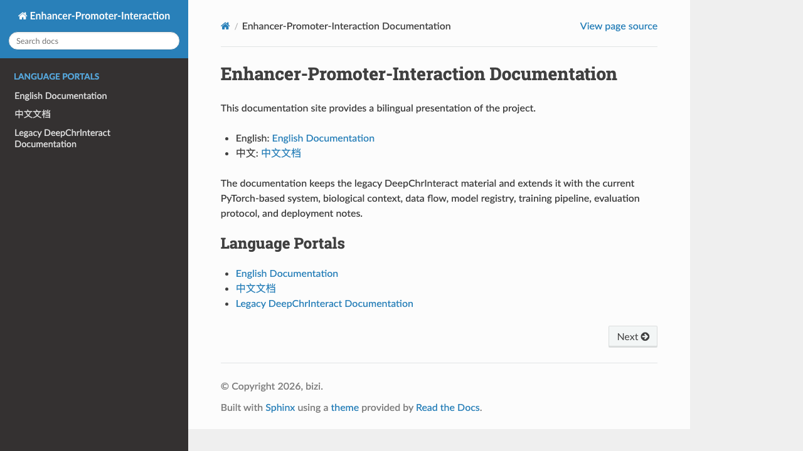

English:

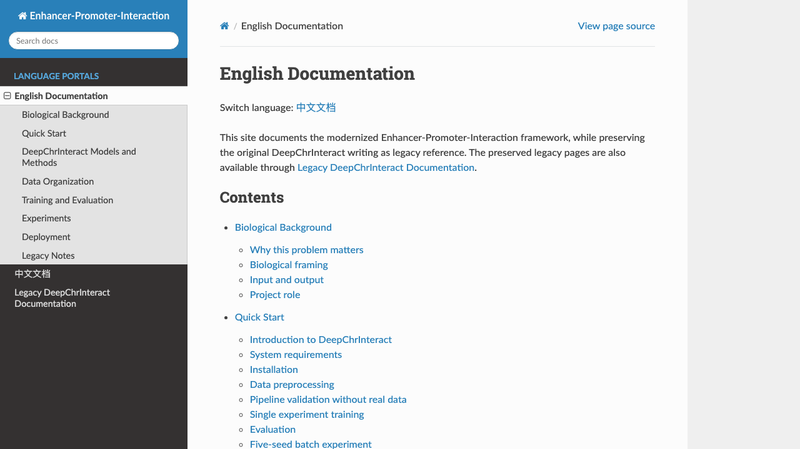

Chinese:

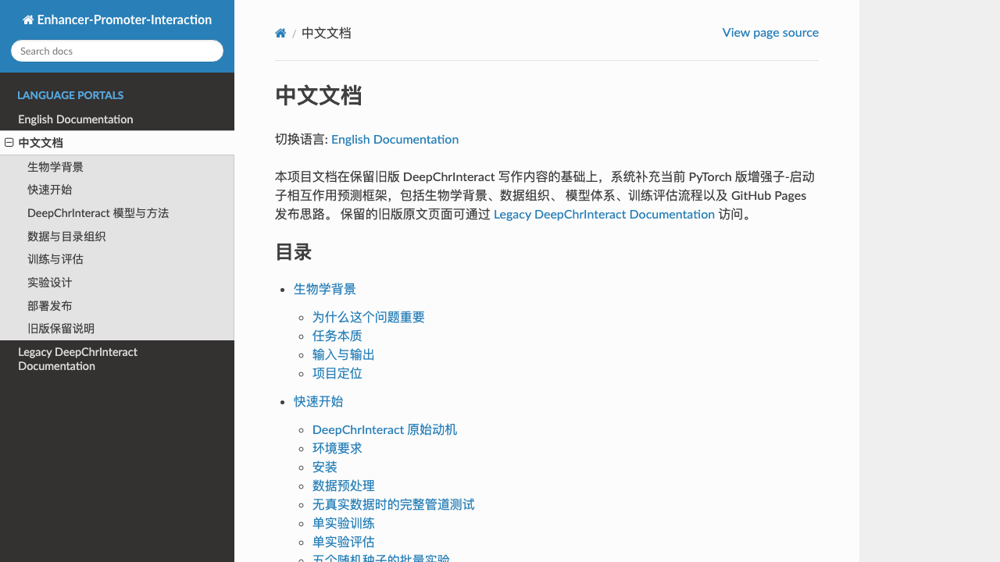

### Model Documentation Gallery

Model overview:

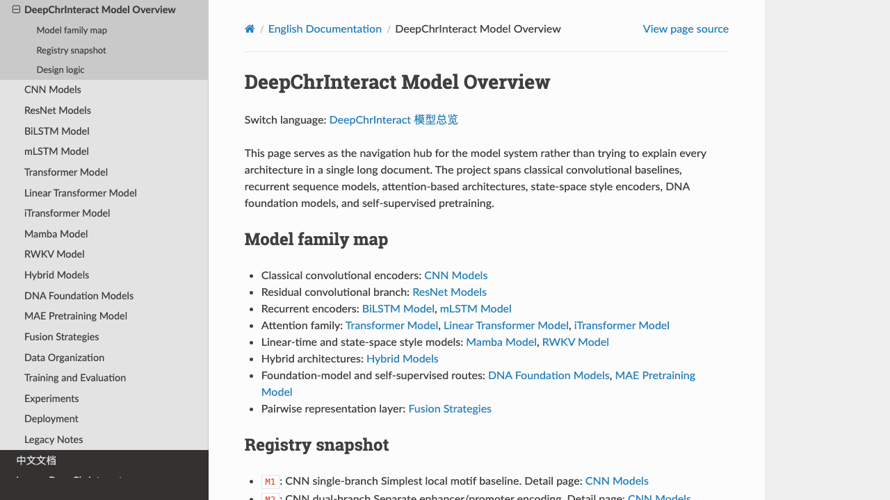

CNN models:

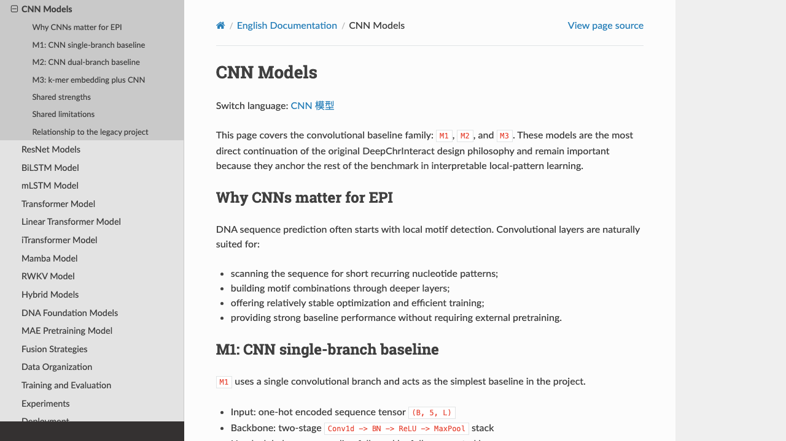

ResNet models:

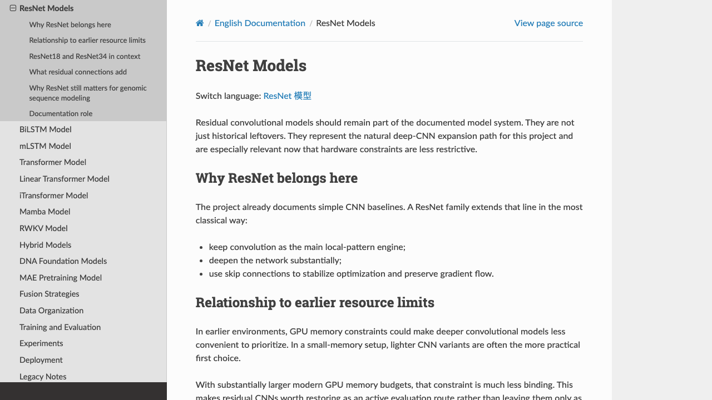

BiLSTM model:

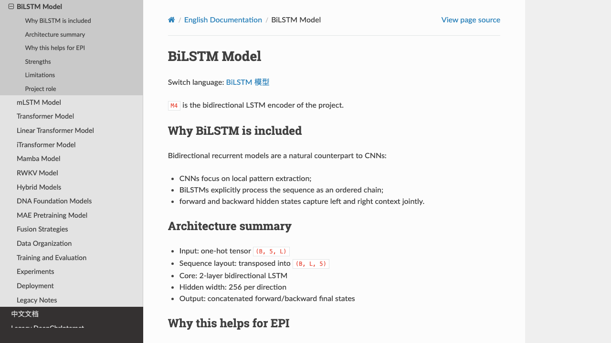

mLSTM model:

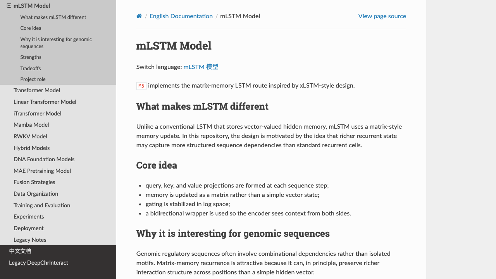

Transformer model:

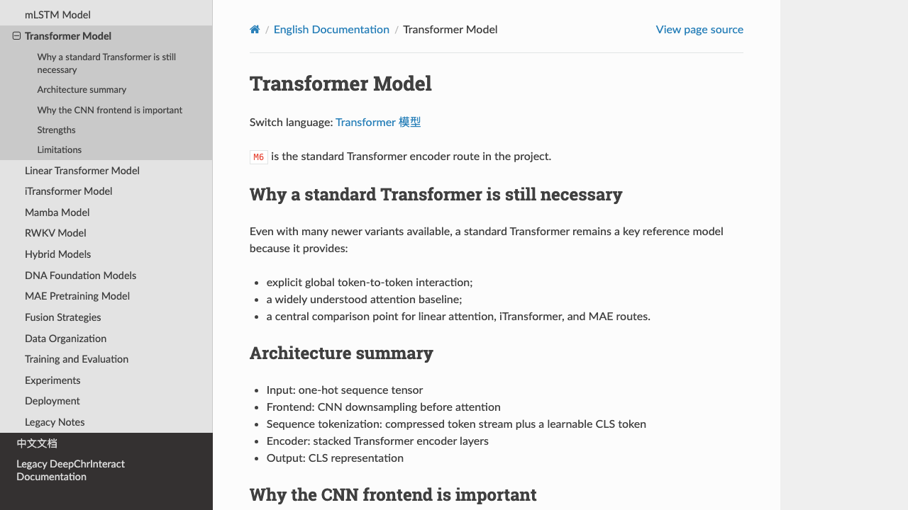

Linear Transformer model:

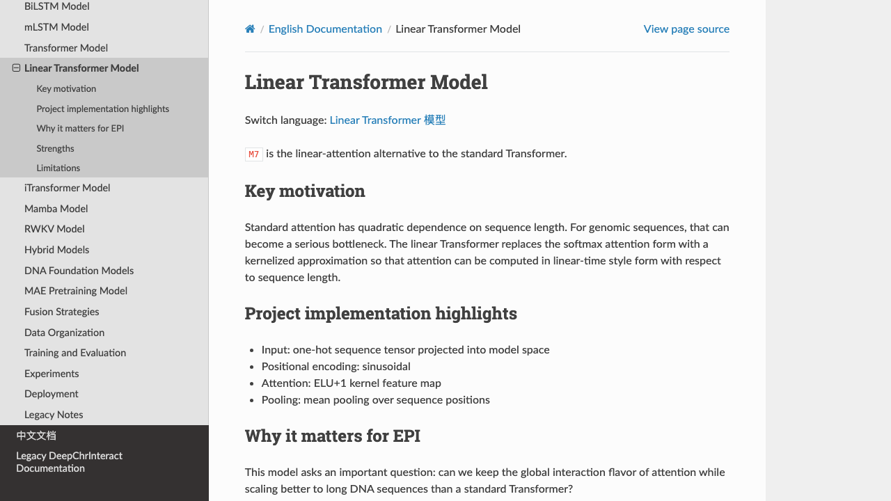

iTransformer model:

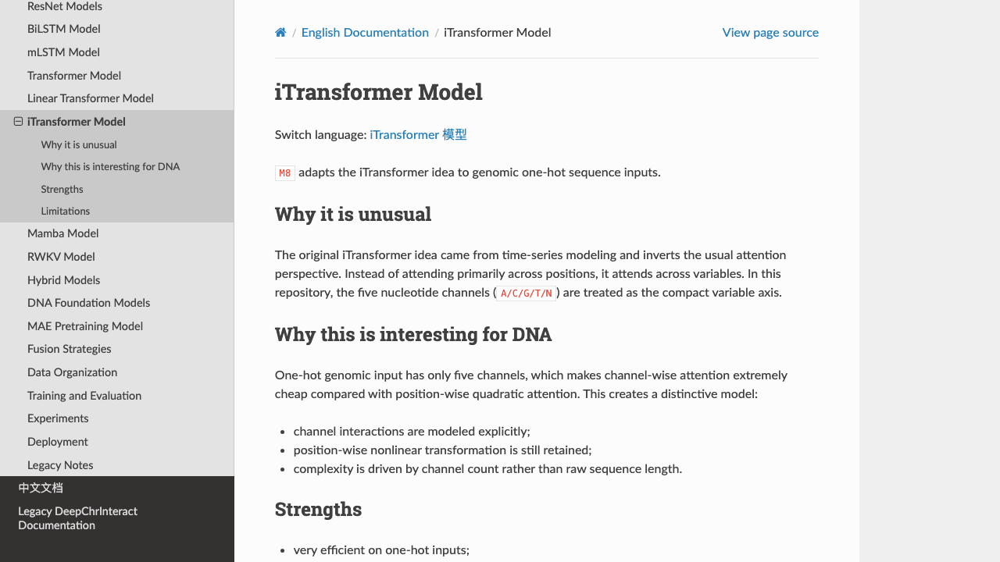

Mamba model:

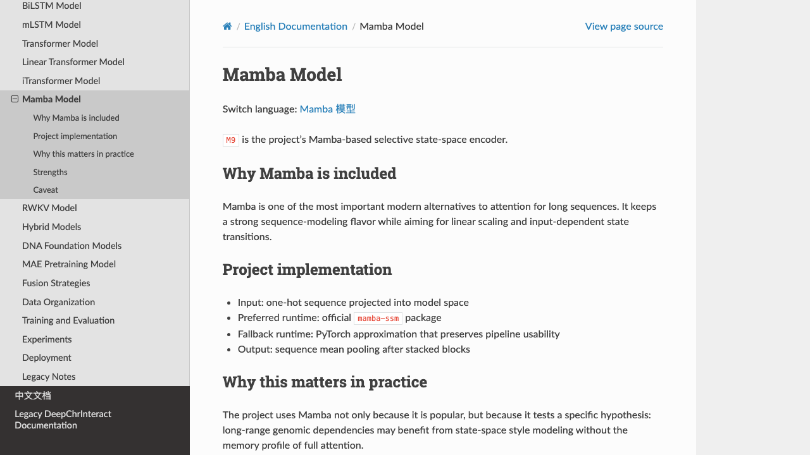

RWKV model:

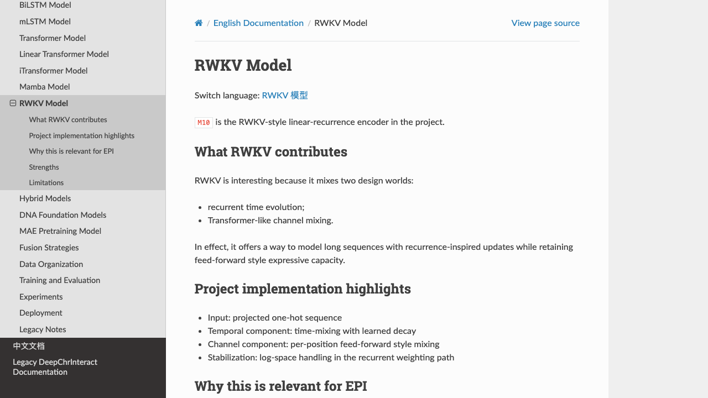

Hybrid models:

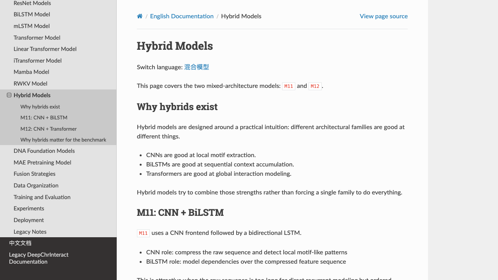

DNA foundation models:

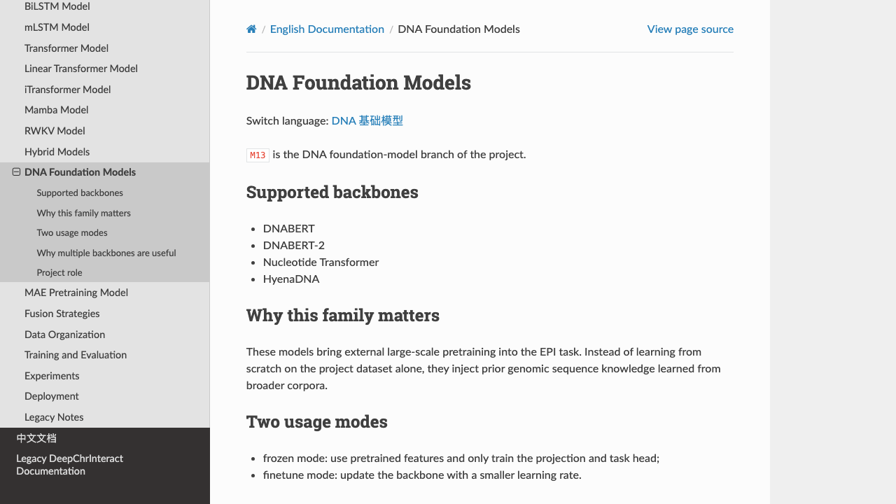

MAE pretraining model:

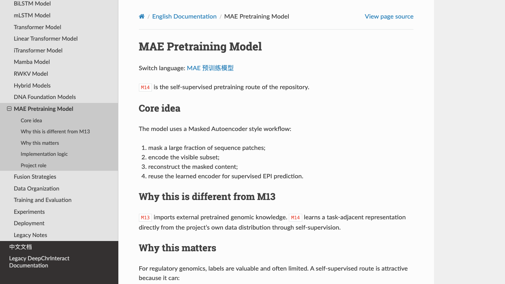

Fusion strategies:

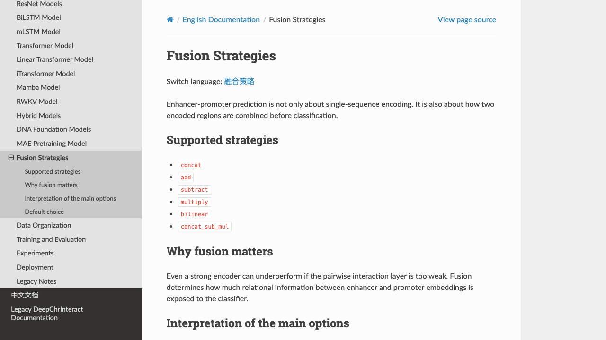

## Repository Structure

```text
.
├── src/
│   ├── config.py
│   ├── encoders.py
│   ├── dataset.py
│   ├── train.py
│   ├── evaluate.py
│   └── models/
├── scripts/
│   ├── preprocess.py
│   ├── run_experiment.sh
│   └── test_pipeline.py
├── latex/
├── DeepChrInteract-main(old)/
├── PRD.md
└── TASK.md
```

## Model Registry (M1-M14)

| Group | ID  | Model | Encoding |
|------|-----|------|---------|
| A | M1  | CNN single-branch baseline | One-Hot |
| A | M2  | CNN dual-branch baseline | One-Hot |
| A | M3  | k-mer Embedding + CNN | k-mer |
| B | M4  | BiLSTM | One-Hot |
| B | M5  | mLSTM (xLSTM / Bio-xLSTM) | One-Hot |
| C | M6  | Standard Transformer | One-Hot |
| C | M7  | Linear Transformer | One-Hot |
| C | M8  | iTransformer | One-Hot |
| D | M9  | Mamba | One-Hot |
| D | M10 | RWKV | One-Hot |
| E | M11 | CNN + BiLSTM | One-Hot |
| E | M12 | CNN + Transformer | One-Hot |
| E | M13 | DNA LLM (DNABERT / DNABERT-2 / NT / HyenaDNA) | LLM embeddings |
| E | M14 | MAE-pretrained Transformer | One-Hot |

### Fusion Strategies

| Strategy | Formula | Output Dimension |
|------|------|---------|
| concat | [h_e; h_p] | 2d |
| add | h_e + h_p | d |
| subtract | h_e - h_p | d |
| multiply | h_e ⊙ h_p | d |
| bilinear | h_e^T W h_p | 1 |
| **concat_sub_mul** *(default)* | [h_e; h_p; h_e-h_p; h_e⊙h_p] | 4d |

## Installation

```bash
pip install -r requirements.txt

# Optional, for CUDA-enabled Mamba environments:
pip install mamba-ssm
```

## Data Format

Each cell type is expected to provide four plain-text sequence files:

```text
data/raw/{cell_type}/
    seq.anchor1.pos.txt
    seq.anchor2.pos.txt
    seq.anchor1.neg.txt
    seq.anchor2.neg.txt
```

## Quick Start

### 1. Preprocess real data

```bash
python scripts/preprocess.py \
    --raw_dir data/raw \
    --cell_type GM12878 \
    --out_dir data
```

### 2. Run a pipeline sanity check without real data

```bash
python scripts/test_pipeline.py
python scripts/test_pipeline.py --quick
```

### 3. Train a single experiment

```bash
python -m src.train \
    --model_id M2 \
    --exp_id E03 \
    --encoding_mode onehot \
    --fusion_strategy concat_sub_mul \
    --cell_type GM12878 \
    --seed 0
```

### 4. Run a full 5-seed experiment

```bash
bash scripts/run_experiment.sh E03 M2 GM12878 onehot concat_sub_mul
```

### 5. Run M14 MAE pretraining and finetuning

```bash
python -m src.train --model_id M14 --exp_id E16 --pretrain
python -m src.train --model_id M14 --exp_id E16
```

### 6. Use the M13 LLM encoder workflow

```bash
python -c "
from src.encoders import LLMEncoder
import numpy as np
enc = LLMEncoder('dnabert2')
enc.encode_dataset(seqs_e, seqs_p, out_dir='data/GM12878/llm_dnabert2')
"

python -m src.train \
    --model_id M13 \
    --encoding_mode llm \
    --llm_backbone dnabert2 \
    --llm_frozen \
    --exp_id E09
```

## Key Configuration Arguments

| Argument | Default | Description |
|------|--------|------|
| `--model_id` | M1 | Model ID, M1-M14 |
| `--encoding_mode` | onehot | onehot / kmer / llm |
| `--fusion_strategy` | concat_sub_mul | Fusion strategy |
| `--cell_type` | GM12878 | Cell type |
| `--batch_size` | 32 | Training batch size |
| `--lr` | 5e-5 | Adam learning rate |
| `--max_epochs` | 100 | Maximum epochs |
| `--patience` | 15 | Early stopping patience |
| `--seed` | 0 | Random seed |
| `--dummy` | False | Use random tensors without real data |
| `--pretrain` | False | Enable M14 MAE pretraining mode |
| `--resume` |  | Resume checkpoint path |

## Output Layout

```text
results/{exp_id}/seed{n}/
    config.json
    best.pt
    last.pt
    history.json
    metrics.json
    roc_curve.png
    pr_curve.png
    summary.json
```

## Main Differences from the Original Codebase

| Aspect | Original (Keras 1.x) | v2 (PyTorch) |
|------|-----------------|--------------|
| Framework | Keras + TF 2.3 | PyTorch 2.0+ |
| Intermediate files | PNG-based preprocessing | **None**, online encoding |
| Number of models | 4 | **14** |
| Fusion strategies | concat | **6** |
| Evaluation metrics | Accuracy | AUROC + AUPRC + F1 + Accuracy |
| Early stopping | No | Yes |
| Resume training | No | Yes |
| Multi-seed summary | No | Yes |

## Paper Materials

Technical details are documented in `latex/main.pdf`, including:

- encoding strategies (One-Hot / k-mer / LLM)
- all 14 encoder architectures
- experiment plans (E01-E16 plus fusion ablations)
- related-work coverage for Mamba, RWKV, xLSTM, iTransformer, MAE, and DNA
  foundation models

## Legacy Archive

The original Keras implementation is preserved in `DeepChrInteract-main(old)/`
for historical reference.
